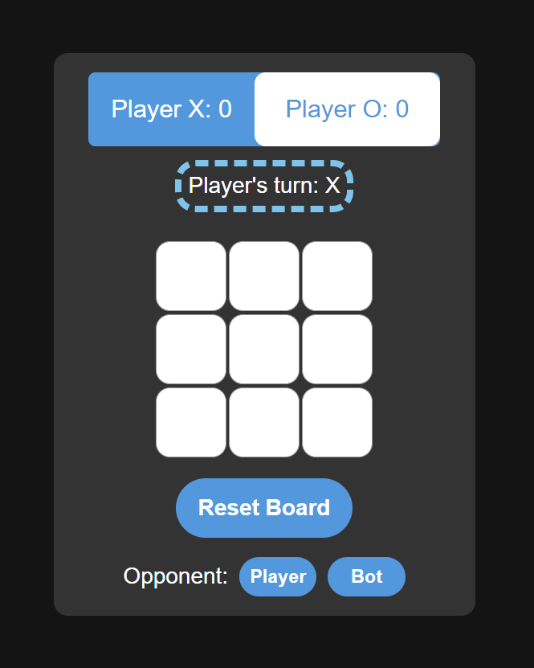

# [Tictactoe](Tictactoe Using React Made By AlonRTPve)

Tic Tac Toe game (web version) made using HTML, JS, REACT.

## About The Project

This is a very simple and light tic tac toe web game made using HTML, CSS, JS and REACT. This game is very easy to play.



### Tech Stack

* HTML
* JavaScript
* CSS
* React

## Getting Started

To get a local copy up and running follow these simple steps.

### Setting up the Project

1. Clone the repo
```sh
git clone https://github.com/AlonRTPve/TicTacToe
```
2. Change the directory
```sh
cd tictactoe
```
3. Install dependencies by running
```sh
 npm install 
```
4. Run by typing in cmd:
```sh
npm start
```

### Features to add

- [x] Add BOT
- [ ] ADD Sockets
- [ ] Add Multiple Bot Levels (implement minimax algorithm)

