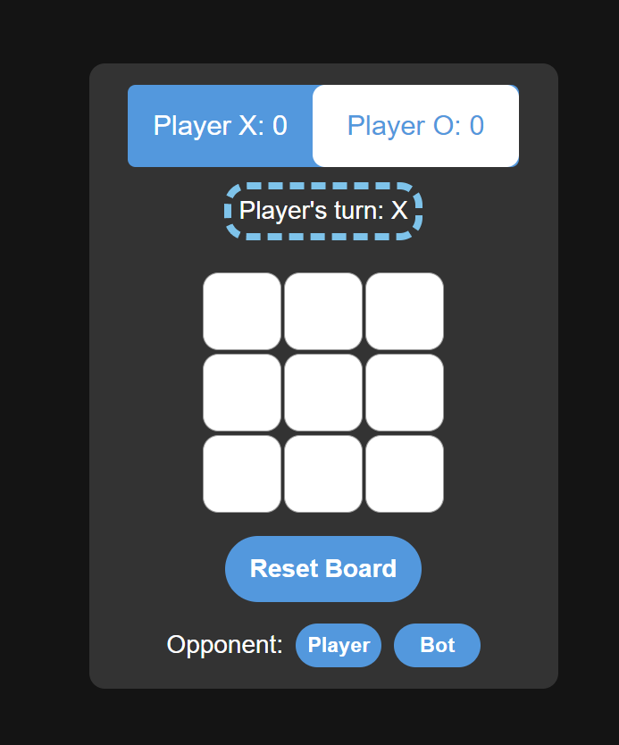

# [Tictactoe]([githublink (notyetupdated)]/ "tictactoe")

Tic Tac Toe game (web version) made using HTML, JS, REACT.

## About The Project

This is a very simple and light tic tac toe web game made using HTML, CSS, JS and REACT. This game is very easy to play.



### Tech Stack

* HTML
* JavaScript
* CSS
* React

## Getting Started

To get a local copy up and running follow these simple steps.

### Setting up the Project

1. Clone the repo
```sh
git clone https://github.com/AlonRTPve/TicTacToe
```
2. Change the directory
```sh
cd tictactoe
```
```sh
3. npm install 
```
```sh
4. npm start
```
```sh
5. go to localhost:3000 and you can start playing
```
### Features to add

[*] ADD BOT (implement minimax algorithm)
[*] ADD Sockets
